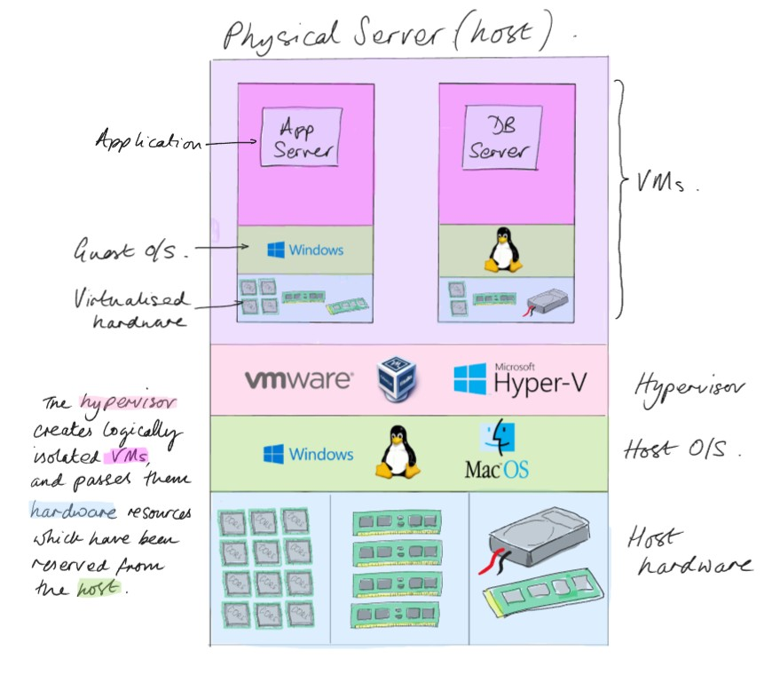

# Introduction to Virtualisation

This repository is intended to complement the Generation DE bootcamp; you will learn a wide range of technologies and use various different applications; however, each of them has different requirements, or work best in different environments.

This is actually exactly the type of scenario that Docker is designed to help with, therefore we're going to use it.

>There are different ways we could approach the different areas you'll cover, in some cases easier approaches such as just installing the Windows* version. However, this isn't really aligned with industry-processes, so this way is a bit trickier at first, but more realistic.  

\* If you have tech-issues during the program, one fall back option will be trying the Windows version

## Virtualisation

If you have a computer, it's going to crash! Most crashes are software, this could be the application, services, dependencies, or the OS. Hardware failure is also possible, but less common. Unfortunately, when one thing fails, the whole computer can fail, taking all of your apps down, not just the failed one.

If it's your home computer, it's probably not the end of the world; but in the enterprise environment, where revenue depends upon these servers and apps being up and stable, this scenario is unacceptable.

>A server is simply a computer with the primary purpose of providing services to clients. They can be different form factors to the common desktop computer (for example rack and blade servers to fit in data centers), and usually they're more powerful, but they contain the same basic components i.e. CPU, RAM, HDD, NIC, etc.

The solution was a technology called `virtualisation`, which allows you to take a physical server, and use it as multiple isolated virtual machines (VMs). With virtualisation you can create a dedicated virtual machine for every important app in your organisation. This is done though a software layer called a `hypervisor`, which reserves some of the hardware from the host, and allocates it to the VMs you create.



This approach makes the servers (VMs) more stable, because each one has only one job to do; we call this `role isolation`. But if (when) it fails, only that VM fails, and the others remain stable.

## Virtual Machines

Virtual machines are computers, with all of the hardware, software, and capabilities of a physical computer, it's just that you cannot actually touch it - it's virtual, just like a piece of software.

Like a physical computer, a VM requires hardware components, reserved from the host, by the hypervisor; it also needs it's own operating system, and then you can install whatever app(s) you want to run on the computer.

This means when purchasing a physical server to host VMs, you need to carefully plan to ensure that you have purchase sufficient hardware for all of your VMs and the host.

For example, you could purchase a server with the following specs:

- CPU: 32 cores
- RAM: 128 GB
- HDD: 8 TB SSD / 50 TB HDD

Then deploy any combination of virtual machines within the hardware limits, for example:

- 7x VMs with 4x cores, 16GB RAM, 500GB SSD, 5TB HDD (leaving the same again for the host)
- 1x VM with 16x cores, 64GB RAM, 4TB SSD, 30TB HDD; then 3x more of the ones above (with the same for the host)

A key benefit is that if any single VM were to fail due to software issues, because they're logically isolated, all of the others should remain stable*.

>\* The VMs are vulnerable to a hardware failure on the host or the host's OS. This can be mitigated by deploying multiple redundant and/or load balanced host servers.

### Limitations of VMs

Using virtualisation to create virtual machines is a powerful technology, allowing organisations to create new VMs on demand, scale them by allocating more resources from the physical host, as well as duplicate and replicate the VMs easily.

>FYI. We've basically just described the cloud - just replace '*physical host*' with '*data center*'

This is a popular option, and many organisations rely upon large fleets of virtual machines, however, there are some challenges when working with them.

- **Hardware Planning**: The host and the VMs share a fixed pool of resources, so you can either buy more than you need in advance to allow space for growth, which is expensive, or you can upgrade the physical host when needed, which is  slow, and requires downtime.
- **Duplication**: Because the host and the individual VMs are each an entire independent computer, they each need their own entire operating system; Windows alone can easily be >20GB, multiplied by the number of VMs, that's a lot of duplicate data, which is inefficient.
- **Size and Speed**: Whilst portable, their large size means VMs are not instant. If you need to copy or transfer a large VM it can take a while, and initial startup of an OS like Windows can take several minutes. That's very fast compared to having to order one and wait for delivery... but a few minutes of downtime can still be a big problem for a mission critical system.
- **Complexity**: Large enterprise environments can rely upon a wide range of applications and platforms; managing Windows, Linux, and MacOS environments, including networking, different protocols, updates, and other maintenance activities can become very difficult.

## Containers

Containers use virtualisation in a different way. Initially you can think of them as *slim* VMs, making them fast, and efficient. But read on for a deeper dive...

### Containers vs. Virtual Machines

With virtual machines you create an entire logical computer which shares the hardware layer with the host, looking at the layered computing model diagram, this means that the VM needs it's own version of everything above the hardware layer, including it's own entire operating system, all required middleware and dependencies, and finally the application that you want to install.

Containers share the hosts resources at the operating system level, which means they only need everything above that level, i.e. the dependencies, and the application files. Containers need a tiny little piece of an operating system, specifically a file system and user profile for the application installation, and a shell so that you can log onto and interact with the container if you need to.

### Advantages of Containers

Containers can directly address the challenges outlined with VMs above.

- **Hardware Planning**: Containers of course require hardware resources to run their assigned task, but they do not need to exclusively reserve it; additionally, because the container doesn't need to run an entire operating system, you can run many more containers than you can VMs on any particular physical server.
- **Duplication**: Since containers share the host's operating system, we do not need to install the same OS multiple times, using our storage more efficiently.
- **Size and Speed**: Because containers share the host OS, when you start one, the OS is already running. So, a new container can be created as quickly as the app can launch, which is typically in seconds. Additionally, containers are much smaller, because they only contain the application data, so they're much easier to duplicate and migrate.
- **Complexity**: At a small scale, containers are very easy to manage using Docker, as we'll see. But as you scale up containers could easily increase complexity, especially if a company decides to replace dozens of VMs with hundreds of containers.

>Conveniently, although out of scope for our program, there are technologies such as Kubernetes, a `container orchestration` tool, which is designed to abstract the complexity and management of giant fleets of containers, behind a relatively simple set of commands and tools.

In addition to addressing those specific challenges, there are many more advantages to using containers to host your apps.

#### Compatibility

Some apps require a completely different versions for the different operating systems, one for Windows, one for Mac, and one for Linux - that's without accounting for different versions of each OS. Also, each of these systems can have different hardware configurations, making life very difficult for the developer trying to ensure their app works.

If the developer can containerise thier app, they only need to make one version of it, and it will run identically anywhere on any system that runs Docker - which can be Windows, Mac, or Linux.

#### Microservice Architectures

Remember when we reviewed virtual machines and we mentioned `role isolation`? Instead of installing all of our apps on one server, and increasing the risk of failure, we instead separate them out onto individual systems, improving stability and flexibility.

Micro-services (also known as de-coupled) architectures, basically apply the same logic to your code.

Instead of having one large code base, containing various complex functions, you instead refactor your code into separate components. You can then run each individual component in a separate container, and then connect them all back together with APIs.

This may sound complex - and it is. It helps if you have this architecture in mind from the outset. However it brings significant advantages.

- **Component isolation**: Our apps are often complex, and despite our best efforts, bugs will occur. An error in one rarely used function can bring an entire app down, even it has dozens of other functions which work perfectly - just like our challenges with software on our servers. Containers and microservice architectures can make your app resilient to these failures.
- **Scaling**: In a typical app, some functions are very simple, such as capturing some user input, or manipulating some strings and variables; some of your functions may be significantly 'bigger' and require a lot more processing time and power to complete. Scaling allows us to assign more resources by running more container instances for these 'heavy' app components, speeding up the application runtime by spreading the workload.


## What is Docker

Docker is a crucial part of the software stack for many different organisations, and for many different reasons.

- It permits rapid deployment of applications
- It provides isolated environments for app's, improving stability and security
- Improved compatibility because we don't need different versions of an app for Windows, Mac, and Linux, just one dockerised version.
- and many more...

Docker is a platform that allows you to develop, ship, and run applications in containers. It includes a number of components:

### Docker Components

- **Docker Engine**: An application which includes a Docker Daemon (a Linux background service) which manages Docker objects like images, containers, networks for containers to communicate, storage volumes for persistent data, etc. Docker Engine hosts `REST APIs` which receive commands from…
- **Docker Client**: The user side component of Docker, which takes CLI commands from the user, and turns them into API calls to Docker Engine.
- **Docker Images**: Packages containing everything needed to run an application, including application code, libraries, dependencies, etc. **A Docker Container is a running instance of this image**.
- **Dockerfile**: A text file containing commands to build a Docker Image.

Here is a simple Dockerfile, don't worry about creating it right now, we'll deploy some containers shortly.

```sh
FROM python:3.9
COPY . /app
WORKDIR /app
RUN pip install -r requirements.txt
CMD ["python", "app.py"]
```

- `FROM python:3.9`: Specifies the base image, in this case the official Python 3.9 image from Docker Hub. Using the base image ensures consistency
- `COPY . /app`: Copy the contents of your current working directory `.` to the `/app` directory inside the container.
- `WORKDIR /app`: Defines the working directory for subsequent commands (default = root / )
- `RUN pip install -r requirements.txt`: Install required dependencies defined in the requirements.txt file using pip (Package Installer for Python).
- `CMD ["python", "app.py"]`: Commands to run when the container starts, they’ll run in the specified working directory.

There are a couple of additional components to be aware of:

- **Docker Hub**: A cloud based repository for storing and sharing Docker Images. You can make public and private repositories.
- **Docker Compose**: A tool which allows you to create YAML files which define multi-container applications, and deploy them as a single unit.

---

If you have not yet deployed and configured a CentOS VM [click here](./deploying-centos-vm.md), if you have already done so [click here](./installing-docker.md) for Docker installation instructions.
