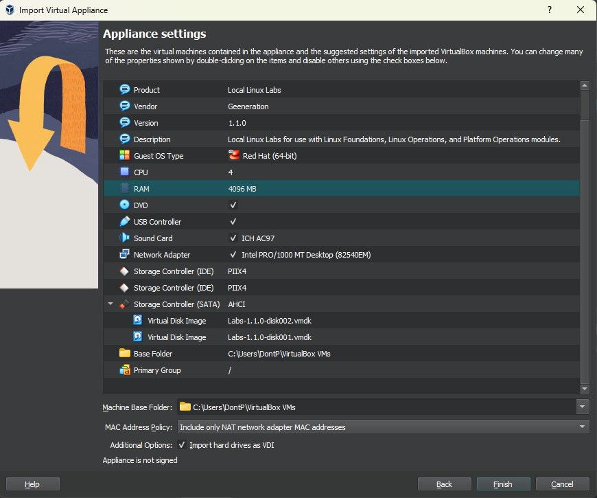
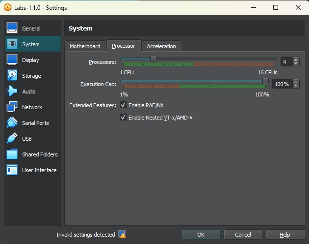
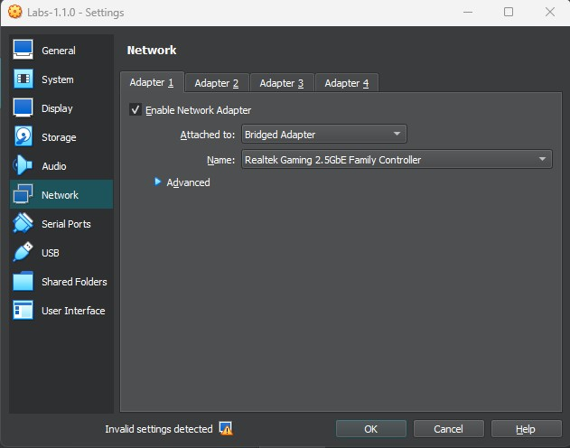
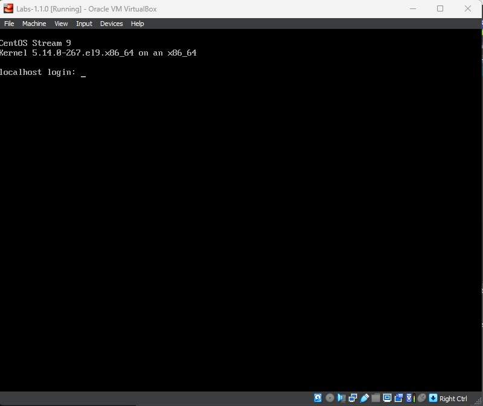
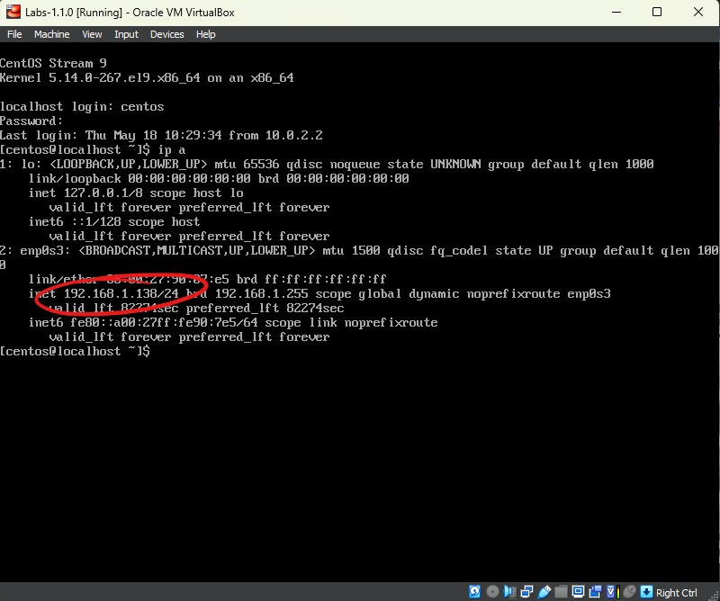
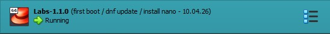
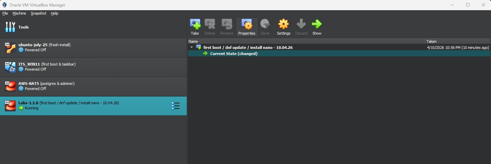

# Deploying a CentOS Virtual Machine

These instructions guide you through the installation of a CentOS virtual machine, which can be used when following Generation's Introduction to Linux module, and various related technologies.

## Installing VirtualBox and Importing the CentOS Image

The VM has been created using the VirtualBox hypervisor, which is one of many common options, but VirtualBox is free for personal use and has cross-platform compatibility.

---

1. Download and install the [VirtualBox application](https://www.virtualbox.org/wiki/Downloads), install it like any other Windows app, accept default configuration options.
2. Download the [VM image](https://drive.google.com/file/d/1xAbGEoVB6KXfpf_Cc2ClQWyYCvqB0rU3/view?usp=drive_link), it is in a ZIP file, which you need to extract to a known location. If successful you should see a file called `CentOS-1.1.0.ova`.
3. Once you have installed and opened VirtualBox click `File` > `Import Appliance`, in the dialog box click the icon at the end of the `File:` field. 
4. Navigate to and select the extracted `CentOS-1.1.0.ova` file, and click next. The next page presents you with an overview of the pre-configured settings for the VM. 
   >NOTE: I've doubled the CPU cores and RAM from their defaults of 2/2048, if you have a powerful computer you may do so too for better performance, but the defaults are sufficient.
5. Click Finish and wait for the VM to import, **do not start it yet**. Once imported your VM will show up on the left, the default name is `Labs-1.1.0`.
   >If you wish to deploy it multiple times to create a multi-VM environment, just change the name on the summary page.
6. Select your VM on the left panel, then click `machine` > `settings`. We need to change a couple of things:
   - Go to `System` on the left > select the `Processor` tab > Turn on `Enable Nested VT-x/AMD-V`
   - Next go to `Network` on the left, change the `Attached to:` option from `NAT` to `Bridged Adapter`.
7. Click OK, and then start your VM; it should open in a new window (for now think of this as your virtual monitor), and once it's finished booting you will see a login prompt.

### Accessing Your Virtual Machine

VirtualBox has some annoying default behaviours, one is that it doesn't integrate very well with the host system out of the box. This means that things like copy/paste don't work from your host to the VM if you use it through the '*virtual monitor*'. Another thing is that when you click on the screen to interact with your VM, it captures your mouse within the screen and you can't get out again; In order to 'release' your mouse pointer you need to press the right-CTRL key, which many laptops don't actually have, to save keyboard space.

So, eventually we're going to connect to our VM in a different way, using `SSH` through a terminal, which is actually more aligned with how we connect to remote machines in the real-world. But to do this we need to know the VMs IP address on your local network (LAN), and the quickest way to get it is to just log in through the virtual screen once, check the IP, then log out again.

#### Logging in

On the login page you're prompted for `localhost login: _`, enter the username: `centos`

You're prompted for the `Password:`, this is also `centos`, exactly the same as the username. But you will not see anything on the screen to indicate that you are typing - not even asterisks (*to prevent shoulder surfing attacks*); just ensure you type it carefully.

If successful your prompt will change to `[centos@localhost ~]$`

- `centos` = username
- `localhost` = hostname
- `~` = current location (~ = home)
- `$` = the Linux prompt waiting for your commands

#### Retrieving the IP Address

Now we're logged in we just need to get the VM's IP address, type `ip a` and you should see an output like the following 

You can see there are two adapters `lo` and `enp0s3`; we don't need to worry about loopback for now, we want the IP address for the second adapter, circled in red and labeled `inet`. **Some of the specific details will vary in your output.**

Make a note of the IP address, in my case `192.168.1.138`, the `/24` isn't relevant right now.

Finally we can log out of this interface, and access the VM via ssh, which is how it's done in industry, simply type `exit` at the `$` prompt, and you'll be returned to the login page. Leave the machine 

### Connecting to your VM with SSH

To connect to your VM using SSH open `PowerShell` from the Start Menu (or right click on Start and select `Terminal`), then type `ssh centos@[VM_IP_ADDRESS]`.

- **ssh** = protocol
- **centos** = username
- **VM_IP_ADDRESS** = destination

You will be prompted for a password, as before when you type the password there is nothing outputted to the screen, so just type the password carefully.

>In this case the VM has been configured for password based authentication, which is not best practice, but easier for our use case. You might want to challenge yourself to set up key-based authentication.

Now you should be logged into your Linux CentOS virtual machine, indicated by a prompt which looks like this:

```Bash
[centos@localhost ~]$
```

You've now logged into the VM via your Terminal, rather than the VirtualBox 'screen', which is how you're likely to connect to remote devices in the real world. The Terminal is also integrated with your Windows environment, allowing things like copy & paste.

When you want to use you computer you sit in front of the monitor and use the keyboard and mouse, all of which are plugged into the device. However, the vast majority of Linux computers are in data centers (and most of them are virtual) with nobody sat in front of them, logged directly in. To use these computers we need to log into the Shell remotely, which is what you just did; using SSH, you opened the Bash Shell for your CentOS VM through the Windows' Terminal.

### The Shell

The core of modern operating systems is a component called the kernel, which manages and controls access to hardware resources. However, the kernel is very complex, the raw lines of code that power your OS, so for normal humans to use the computer we need an interface that provides accessible ways to use with the system, and the interfaces interacts with the kernel on our behalf.

The Windows desktop is an example of one of these interfaces, you click an icon, and an instruction is sent to the kernel to open this application from storage, which the kernel controls access to.

Although you can install one, Linux servers typically do not have a desktop environment for a few reasons:

- The desktop uses system resources unnecessarily - most Linux servers are in data centers, and nobody is sat in front of it looking at a monitor, so why waste the RAM and CPU resources?
- The additional software components required for the desktop introduce greater potential for software bugs.
- Desktops are slow

The interface that Linux servers use is called the Shell, the most common version is called `Bash` (`B`ourne `A`gain `SH`ell).

A shell can do the same things your GUI environment does:

- Launch applications
- Open, edit and manage files and folders
- Send email
- Code
- Play Star Wars Episode IV

>Windows `CMD` and `PowerShell` are also examples of Shells (*the hint is in the name*). It is possible to install Windows Server without a desktop, and just use PowerShell to interact with it - this makes the installation a lot smaller.

The Shell provides us with a command line interface into which we can enter our commands to operate and control our system. Therefore, learning to use the Shell, is basically learning to use Linux, so we'll return to it in a separate guide coming up next. First we need to do a little more config on our VM, and learn about one more feature of VirtualBox.

### Updating Linux

We'll review how this works in our next lesson, but suffice to say that the VM image you used is a bit out of date, so we need to update it before we start using it for any real work.

Do so by typing `sudo dnf update -y`

- `sudo`: Elevates your user permissions to run the update
- `dnf`: The default Linux package manager fro RHEL distributions
- `update`: The operation to be carried out
- `-y`: Without this option you will be prompted to confirm the operation, this basically pre-answers that check

There is one more useful package that is recommended to install before we proceed to learning to use Linux, called `Nano`.

Nano is a lightweight CLI based text editor, there are other text editor options, for example `VI`/`VIM` is included by default in most Linux distributions. However, VI is the work of the Devil!!! It's very difficult to use efficiently as a beginner, but Nano is a lot more accessible, and uses `CTRL+[KEY]` commands similar to Windows shortcuts.

>The shortcut commands in Nano are not the same as Windows, for example `CTRL+C`/`CTRL-V` doesn't copy/paste, `CTRL+S` doesn't save. Be sure to look at the command prompts at the bottom of the Nano page.

Install Nano with `sudo dnf install nano -y`

This command is similar to the last one, `sudo`, `dnf`, and `-y` are identical, but we want to `install` instead of `update`, and we're providing an argument `nano`, to specify a particular package.

Nearly done, one last step...

## Snapshots

A virtual machine could also be described as a **software defined computer**, and software is comprised of data files. So your virtual machines is actually just a collection of files, and one of these files is the virtual hard disk, which contains the VMs' files.

A snapshot is simply a copy of this hard disk file, which contains all of the data on the virtual hard disk **at a point in time**. If you later encounter a problem with your virtual machine, you can restore the snapshot and recover the VM to whenever the snapshot was taken.

Snapshots provide several benefits:

- We can take as many snapshots as we want, creating regular recovery points.
- Subsequent snapshots after the first only need to capture the changes since the preceding one, and most of the files on the system do not change frequently, so snapshots are typically quite small (this is known as incremental backup).
- In our case you establish multiple 'timelines' for your VM, based on the different projects we work on, and jump between them easily by restoring the relevant snapshot.
- You can take a snapshot of a running VM, which allows you to restore it directly to a running state rather than waiting for it to boot normally.

With all of the preceding steps completed, leave your VM running, but return to the VirtualBox Manager window. Identify your VM on the left, and click the button to the right of the entry 

On the Snapshots page click the `Take` button with the green plus sign .

The `Take Snapshot...` dialog appears, give your snapshot a meaningful name and click `OK`.

---

You now have a functional, up to date CentOS Linux virtual machine which we can use to explore a number of technologies, but first we need to learn how to use Linux.

- [Back to main page](./README.md)
- [Introduction to Linux](NOT YET DONE)
