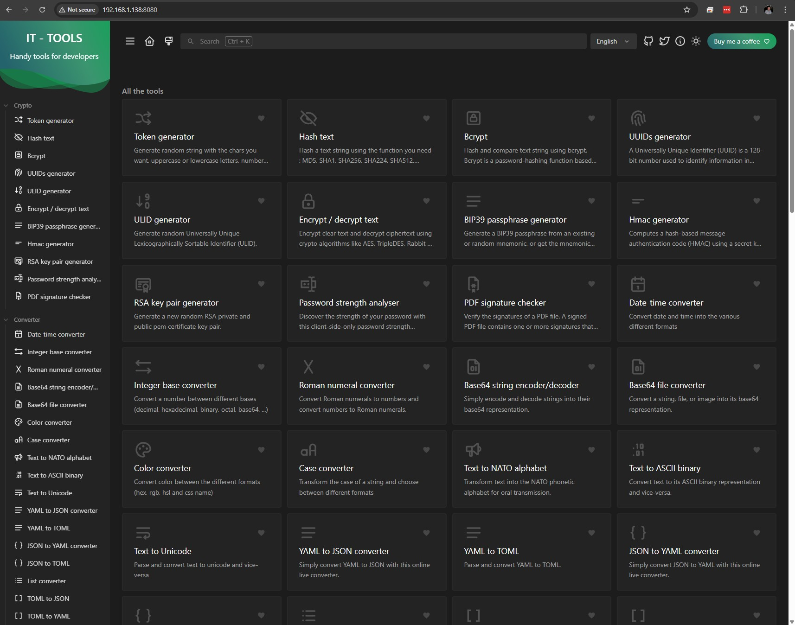
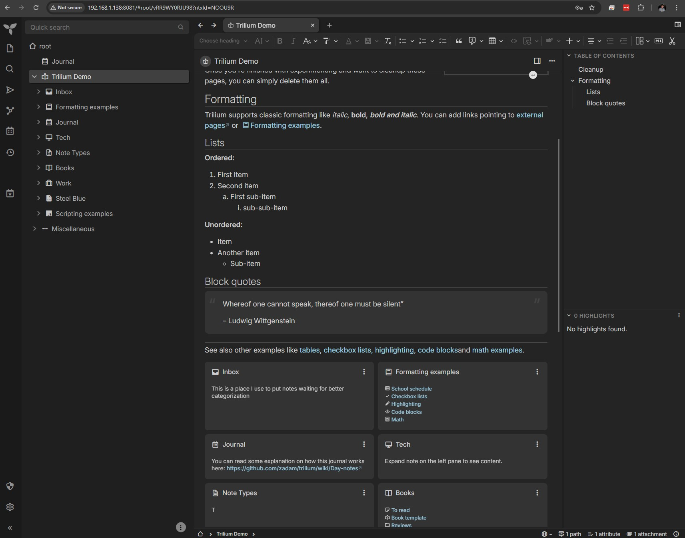

# Deploying Containers

This guide works through deploying some existing apps to practice working with Docker Engine from the CLI.

## Deploying an Existing App

You've already used `docker run` to launch the `hello-world` container, we can also use this command to deploy publicly available, containerised open source apps from Docker Hub.

Run the following command to deploy the `it-tools` container.

```bash
sudo docker run -d -p 8080:80 --name it-tools -it corentinth/it-tools
```

- `sudo`: Elevate permissions
- `docker`: The Docker family of commands
- `run`: Runs a new container, also pulls the required image if needed
- `-d`: **Detached** mode - runs the container in the background
- `-p 8080:80`: Port mapping - forwards host port 8080 to container port 80
- `--name it-tools`:Assigns the name "it-tools" to the container, if omitted a random ID will be used
- `-it`: Interactive + TTY - *Not important for now*
- `corentinth/it-tools`: The Docker image to use from Docker Hub

If successful, at the bottom of the terminal output you should see a container ID returned, something like `fccfc15e674540fa3600590d96bb62ff383e77b34ee78daae9f1a2aec3cfe6ae`.

You can access the IT-Tools application through your web browser by going to `http://[virtual_machine_IP]:8080`, you should be presented with a very useful web-app, full of useful developer tools 

Feel free to spend some time exploring the tools, and save the command above somewhere handy if you think it will be useful to have them available in the future.

When you're finished with your container shut it down with `sudo docker stop it-tools`, confirm it is stopped with `docker ps`.

## Docker Compose

Docker compose is a utility which allows you to deploy and configure containers which are defined in `yaml` files. If you have not already done so, install Docker compose with

```sh
sudo yum update
sudo yum install docker-compose-plugin
```

### Create a Docker Compose file

We're going to install a self-hosted instance of Trilium, an open-source solution for note-taking and organizing a personal knowledge base.

- Create a directory for your containerised app, and move into it.
- Create a file called `docker-compose.yaml`
- In this file add the following:

```yaml
# Running `docker-compose up` will create/use the "trilium-data" directory in the user home
# Run `TRILIUM_DATA_DIR=/path/of/your/choice docker-compose up` to set a different directory
services:
  trilium:
    image: triliumnext/trilium:latest
    # Restart the container unless it was stopped by the user
    restart: unless-stopped
    environment:
      - TRILIUM_DATA_DIR=/home/node/trilium-data
    ports:
      - '8081:8080'
    volumes:
      # Unless TRILIUM_DATA_DIR is set, the data will be stored in the "trilium-data" directory in the home directory.
      # This can be changed with by replacing the line below with `- /path/of/your/choice:/home/node/trilium-data
      - ${TRILIUM_DATA_DIR:-~/trilium-data}:/home/node/trilium-data
      - /etc/timezone:/etc/timezone:ro
      - /etc/localtime:/etc/localtime:ro
```

[SOURCE](https://raw.githubusercontent.com/TriliumNext/Trilium/master/docker-compose.yml)

>**NOTE**: In the original source file the port mapping was `8080:8080` but this would conflict with the it-tools container, so it has been changed to `8081`. This is something to bare in mind as you deploy more and more containers.

- Save and close the file
- Type `docker compose up -d`

If successful you will see the latest image being pulled from Docker Hub, a network being created within Docker, and the container being started. Again, if successful you can access the app at `http://[virtual_machine_IP]:8081`

The first time you access it you'll have to select "First time user..." and set a password, but then have an explore 

Trilium is at it's most basic a personal note taking app, but it's much more powerful than that. Think of it like a knowledge base, or your own wiki, you can organise docs, nest them, add code blocks in various supported languages, including markdown, and much more.

Once finished with your container stop it with `docker compose down`.

> You should run the Docker Compose commands in the directory containing the relevant `docker-compose.yml` file - which is also why you should create individual directories for each container project.

## Stretch and Challenge

Create a container to run your own Python code.

Here is a starter Dockerfile:

``` Bash
# Use the official Python image
FROM python:3.9
# Set the working directory in the container
WORKDIR /app
# Copy the script to the container
COPY script.py .
# Run the Python script
CMD ["python", "script.py"]
```
