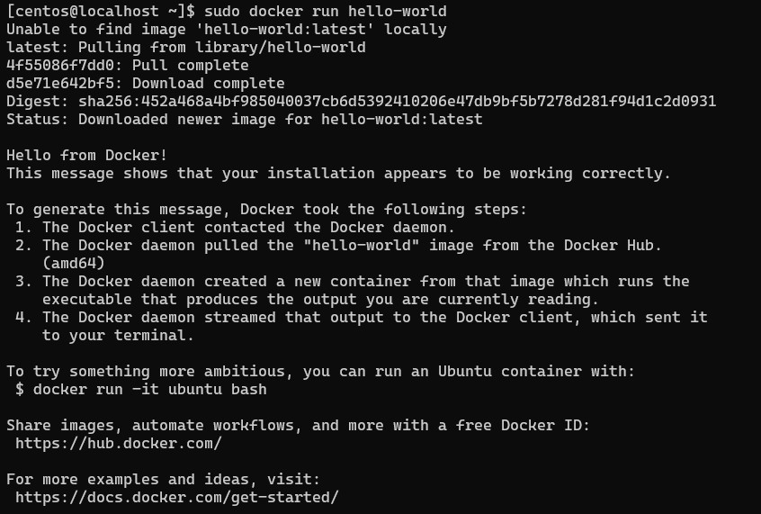

# Installing Docker

There are two common ways to run Docker (and Docker containers):

- **Docker Engine**: The *default* option - Containers in production are expected to run on *‘headless’* servers (without a keyboard/mouse/screen attached), therefore a GUI is not necessary, and management is done with CLI commands over a remote connection such as SSH.
- **Docker Desktop**: The only *‘official’* version on Windows, Docker Desktop provides a GUI based version of Docker; although if you want to use CLI commands as well there is a terminal accessible within the desktop app. 

>\*NOTE: Docker Desktop is licensed software, it’s free for personal use, but commercial use requires you to purchase a license*.

Docker is a technology based on Linux, therefore to use it on Windows we need to enable a Linux `kernel` which runs inside and integrates with Windows. Microsoft provides this through an extension called `WSL2` (Windows Subsystem for Linux), which is required for Docker Desktop. In addition to providing a Linux Kernel for Docker, WSL2 also allows you to run entire Linux distributions in Windows without managing virtual machines.

Docker Desktop is great for self-hosting and personal projects, but for our purposes we'll use Docker within your Linux virtual machine as this is closer to the deployments you'll encounter in enterprise environments (plus: ***professionals** use the CLI; only **users** need a GUI*).

## Installation Instructions

Follow the below instructions to install Docker on your CentOS virtual machine (adapted from the [offical guide](https://docs.docker.com/engine/install/centos/#install-using-the-repository)).

1. Set up the repository - Install the dnf-plugins-core package (which provides the commands to manage your DNF repositories) and set up the repository

```sh
sudo dnf -y install dnf-plugins-core
sudo dnf config-manager --add-repo https://download.docker.com/linux/centos/docker-ce.repo
```

2. Install Docker Engine - This command installs Docker, but it doesn't start Docker. It also creates a docker group, however, it doesn't add any users to the group by default (*Accept the GPG key  - although in the real-world you'd verify it*).

```sh
sudo dnf install docker-ce docker-ce-cli containerd.io docker-buildx-plugin docker-compose-plugin
```

3. This configures the Docker `systemd` service to start automatically when you boot your system.

```sh
sudo systemctl enable --now docker
```

> `Systemd` is the default system and service manager for most modern Linux distributions

4. Verify that the installation is successful by running the `hello-world` image. This command downloads a test image and runs it in a container. When the container runs, it prints a confirmation message and exits.

```sh
sudo docker run hello-world
```

- **docker**: The Docker family of commands
- **run**: Runs a new container, also pulls the required image if needed
- **hello-world**: The container image name

If successful you'll see an output similar to this, notice the `Hello from Docker!` line .

### Docker Compose

Docker Compose is an additional Docker tool which allows us to create and manage complex multi-container applications, in one YAML configuration file. Install Docker Compose with:

```sh
sudo yum install docker-compose-plugin
```

>If the installation was successful it is **strongly** recommended that you take a new snapshot called something like "Docker installed" so that you can easily return to this '*fresh out of the box*' state.

---

Now you have Docker and Docker Compose installed, [click here](./deploying-containers.md) to learn how to deploy some containerised open-source apps from Docker Hub, and your own custom containers.
