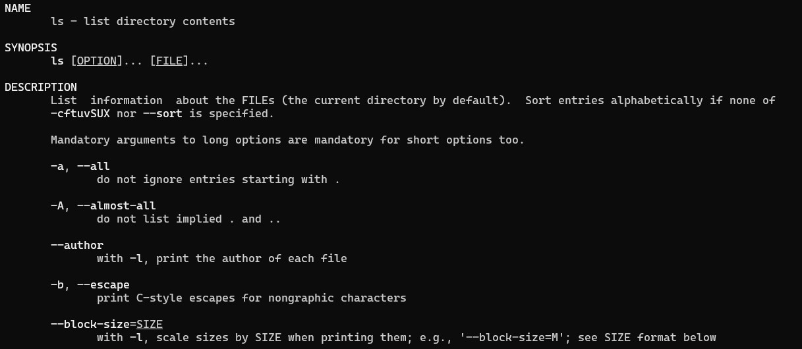

# Introduction to Linux

The software we broadly refer to as `Linux` is actually derived from an earlier operating system called `Unix` (*which is still around - but it's now more of a compliance standard which other operating systems can meet*).

>Linus Torvalds basically re-wrote the proprietary UNIX kernel by hand, then gave it away for free under the `GNU General Public License`, permitting anyone to share and modify it freely.

The majority of operating systems in use today have been developed from this initial project, these can be collectively referred to as `Unix-like`; Beyond the Linux distributions running on millions of cloud servers, Android, iOS, and MacOS are all Unix-like operating systems.

## Linux is NOT an Operating System

Linux is an operating system `kernel` - the part of the operating system that handles the interactions between hardware and software components. The Linux Kernel is included as the core component of many operating systems - which we call **distributions** of Linux. However, since these distributions are all quite similar, and utilise the same kernel, they are collectively known as `Linux`.

## Connecting to a Linux server

Once you’ve deployed a local, or remote, server you need to connect to it in order to issue commands to it. The most common way to do this is using a protocol called `SSH` (`S`ecure `SH`ell).

You can initiate an SSH connection in several ways, we're using the `CLI` (command line interface), but the protocol is universal. There are popular apps dedicated to creating and managing SSH connections providing a `GUI` (graphical user interface), such as `Putty`, which are very useful when you have to log into several different machines regularly.

`OpenSSH` is also available by default in most popular OSes, but not always enabled. This means you can create an SSH connection from directly within your chosen CLI such as the Mac or Windows Terminal.

The command to open the connection is ssh `[user]@[location]`

When you open an SSH connection to a remote server you're presented with the server's Shell.

## The Linux Shell

***Repeated from - deploying-centOS-vm.md***

The core of modern operating systems is a component called the `kernel`, which manages and controls access to hardware resources. However, the kernel is very complex, the raw lines of code that power your OS, so for normal humans to use the computer we need an interface that provides accessible ways to use with the system, and the interfaces interacts with the kernel on our behalf.

The Windows desktop is an example of one of these interfaces, you click an icon, and an instruction is sent to the kernel to open this application from storage, which the kernel controls access to.

Although you can install one, Linux servers typically do not have a desktop environment for a few reasons:

- The desktop uses system resources unnecessarily - most Linux servers are in data centers, and nobody is sat in front of it looking at a monitor, so why waste the RAM and CPU resources?
- The additional software components required for the desktop introduce greater potential for software bugs.
- Desktops are slow

The interface that Linux servers use is called the Shell, the most common version is called `Bash` (`B`ourne `A`gain `SH`ell).

A shell can do the same things your GUI environment does:

- Launch applications
- Open, edit and manage files and folders
- Send email
- Code
- Play Star Wars Episode IV

>Windows `CMD` and `PowerShell` are also examples of Shells (*the hint is in the name*). It is possible to install Windows Server without a desktop, and just use PowerShell to interact with it - this makes the installation a lot smaller.

The Shell provides us with a command line interface into which we can enter our commands to operate and control our system.

## Linux Shell Commands

Controlling your computer entirely from the command line can be challenging at first if you've only ever used a mouse to navigate and open apps or files. Don't worry about memorising commands as you come across them, the important ones you will use so often that they'll quickly become second nature.

Here are the first commands we're going to use:

|Command|Function|
|---|---|
|`ls`|List contents of current directory|
|`cd`|Change directory|
|`pwd`|Print working directory (show your location in the file system)|
|`mkdir`|Make a new directory|
|`touch`|Update access/modification times of a file (**often also used to make a new file**)|
|`cp`|Copy file/directory|
|`mv`|Move file/directory - also used to rename|
|`rm`/`rmdir`|Delete file/delete directory|
|`cat`|Used to read, concatenate, and create files|

Before we try them out, if you've SSH'd into your VM, and done nothing else, then your prompt should look like this: `[centos@localhost ~]$`. This prompt gives us a few bits of information `[current_user]@[system_name] [current_directory]`. The `$` is just the prompt waiting for our command, but it does symbolise that we're currently logged in as a `standard` user.

In our case the location shows as `~` (called a tilde), this represents your home location. By default, as a standard user, this is the only location in the filesystem that you have permission to access and modify. The `absolute path` to your home location is `/home/centos/`; the `~` symbol is simply a shortcut to that location.

>For the purpose of learning, we've allowed you to bypass the standard user restrictions. We'll explain how soon, but you've already done it by using `sudo`.

### Bash Shell - Mini-Lab

Follow the below instructions to practice using the basic commands.

1. If you have navigated away from your home directory return to it with: `cd ~`
2. Confirm your location in the file system with `pwd`, it should be `/home/[username]`
3. Type `mkdir my_project` to create a new directory
4. Type `ls` to verify the directory has been created
5. Move into the directory with `cd my_project`
6. Create a new file with `touch my_file`
7. Verify the file has been created with `ls`
8. Open the file using the Nano text editor by typing `nano my_file`
9. Add some text to the file, then press `CTRL+O` to save, you will be prompted to provide a new file name, press enter to leave it unchanged.
10. Press `CTRL+X` to exit Nano and return to the Bash prompt.
11. Verify that the text is in the file with `cat my_file`
12. Create another directory with `mkdir another_directory`
13. Move my_file into the new directory with `mv my_file another_directory`
14. Confirm the file has moved with `ls`
15. Confirm the file is in the new directory without moving into it using `ls another_directory`
16. Move into the new directory with `cd another_directory`
17. Delete the file with `rm my_file`
18. Move back to the parent directory with `cd ..`
19. Delete the sub-directory with `rmdir another_directory`
20. Repeat the last two steps to go back to your home directory, but delete the `my_project` directory instead

There are two more useful commands which provide you with information about other commands, including the various options and arguments that are supported or required for the command.

- `man`: Shows the manual for any command
- `help`: Provides a more condensed reference page

```Bash
# View the manual for the 'touch' command
man touch
# View the help file for the 'touch' command
touch --help
```

## Linux Command Structure

All Linux commands in Linux follow a standard structure, understanding the structure is useful for troubleshooting when a command doesn't give you the expected result.

Take the `ls` command which you've already seen, it lists the contents of the current location. Below is a section of the man page for ls, it shows some of the options you can use with the command.



Two common options are

- `-a`: All - Display all items including hidden items (which start with `.`)
- `-l`: Long list - Displays items in long-list format, which displays more information about each item.

```Bash
ls # List items in the current directory

ls -a # List all items in the current directory

ls -al # Combine options to customise the output
```

You also saw that `ls` can list the contents of another directory without first navigating to it by providing the target location as an `argument`. Arguments are the values we want the command to operate upon, such as files (directories), services, users, etc.

Combine `options` and `arguments` to get the information you need:

```Bash
la -al /etc 
```

The standard Linux command structure is: `[command] [options] [arguments]`

|Command|Options|Arguments|
|---|---|---|
|`ls`|`-al`|`/etc`|

>The order of options and arguments can often be switched

## Useful Shell Features

The following are some features of the Shell which allow you to build more complex commands, or modify the system behaviour in useful ways.

### Standard Streams

Applications receive input data to work on and produce some output
when they're done. But where does the data come from and where does it go?

The shell provides 3 separate channels to enable data flow in and out
of applications. These channels are known as standard streams and they are
connected to different things by default.

The three streams are:

- **Input**: Known as `stdin` - Where the application receives data from (e.g. keyboard)
- **Output**: Known as `stdout` - Where the application sends output (e.g. Shell Terminal)
- **Error**: Known as `stderr` - Where error messages are sent

Remember, most Linux servers don't have someone logged into them permanently, typing commands or watching the Terminal for output, therefore it is useful to be able to direct there streams elsewhere.

Commonly we'll redirect `stdout` and `stderr` to files which are in shared accessible locations, therefore to check the output or the errors, a user can simply check these files rather than logging onto the system.

```bash
# Run my_app; redirect output to output.txt; redirect error messages to errors.txt
my_app 1> output.txt 2> errors.txt
```

Standard Input can also be redirected, so rather than from the keyboard, the contents of a file can be provided as input.

```bash
# Connect my_app's stdin to the file input.txt
my_app < input.txt
```

### Pipelines

The pipe `|` symbol can also be used for input redirection, it allows you to 'pipe' the output of one command into another one as input.

#### Pipelines Mini Lab

1. Copy the following into a file called `colours.txt`

```sh
blue
black
red
red
green
blue
green
red
red
blue
```

2. Try running the following command: `sort colours.txt | uniq -c | sort -r | head -3` (*breakdown below*)
    - The `stdout` of each command is piped through to the `stdin` of the next, the output is not sent to the Terminal until the final step.
3. Create your own file containing different items, e.g. fruits, names, foods. Try combinations of the above commands, with pipes, to produce different outputs.

**Command breakdown**:

- `sort colours.txt`: Sorts the lines in the file colours.txt alphabetically.
- `uniq -c`: Removes duplicate adjacent lines and adds a count of how many times each line occurred.
- `sort -r`: Sorts lines in reverse order.
- `head -3`: Outputs only the first 3 lines of the input

## Linux Packages

`Package managers` let you install and keep track of software on your
machine. Different versions of Linux have different package managers:

- `Debian` based distributions, such as `Ubuntu`, use `apt` (Advanced Package Tool)
- `Fedora` based distributions, such as `CentOS`, use `dnf` (Dandified YUM).

Some examples of common usage include

```bash
sudo dnf update # Update package information

sudo dnf install [package_name] # Install a package

sudo dnf remove [package_name] # Uninstall a package

sudo dnf upgrade # Update installed packages
```

>MacOS can use a package manager called `Homebrew`, equivalent commands are: `brew update`, `brew install [package_name]`, `brew remove [package_name]`, `brew upgrade`.

## Shell Scripting

Scripting is the process of creating a text file containing commands, which are then executed automatically, following any specified logic, when the file is executed as a program.

You have already written some scripts: You have spent time working with Python, and we discussed writing code in `interactive` mode, where you type one command at a time. But primarily we use `script` mode, where you can write all of your commands, and have Python interpret the whole file one line at a time. This means that in addition to a programming language, Python is also an example of a scripting language.

Linux commands can also be written in a script, these script files will usually end in `.sh`, *but remember the extension is just for humans*.

Pretty much anything you can do with a series of commands, can be automated with a script. Bash scripting also supports many different data structures and logic, allowing you to make lists, variables, loops, etc. to make complete applications with Shell scripts.

>You will do this in the lab below, but it is important to point out: you can `read` a file with the `r` permission; you can `edit` a file with the `w` permission; but to run a file as an app (`execute` it) you require the `x` permission - Review the users, groups, and permissions guide if you're unfamiliar with this.

## Scripting Lab

Below is an example of a script to automatically install and configure a web server.

1. Create a new file, open it with your text editor of choice, copy the following text into it.

```bash
#! /bin/bash # Which interpreter to run i.e. Bash

sudo dnf update -y # Update package info

sudo dnf install httpd -y # Install the Apache webserver

sudo chown apache:apache /var/www/* # Give the Apache user and group ownership of the files.

sudo echo "Hello from your webserver" > index.html # Create an initial index.html document

sudo cp index.html /var/www/html/ # Copy index.html into the directory httpd serves files from

sudo systemctl start httpd # Start the httpd application

sudo systemctl enable httpd # Add a symlink to the app, so it starts during boot

echo "Your web server has started. Access it by typing your VMs IP address into your browser." # Echo a success message to the user.
```

2. Save the file as `deploy_web-svr.sh` and close your editor.

3. In order to use the script you need to execute it as an app, i.e. you need to add the execute `x` permission. To do so type: `chmod u+x deploy_web-svr.sh`

4. Use `ls -l` to confirm the execute permission has been assigned.

5. Run your script with `./deploy_web-svr.sh`

6. You will see the operations being carried out, and it should end with the success message. When you see this you can open your browser, and type your VMs IP address into the address bar. You should see "Hello from your webserver".

**Challenge** - Add some real HTML to your website.
