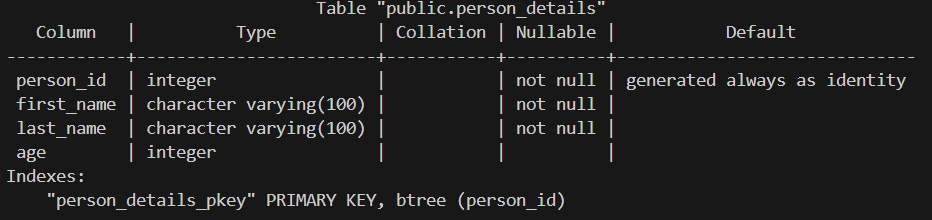
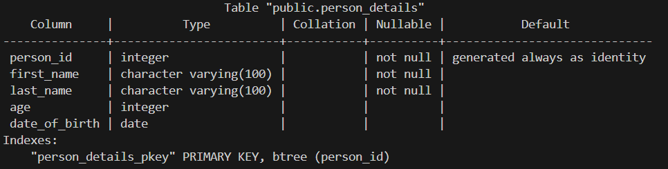
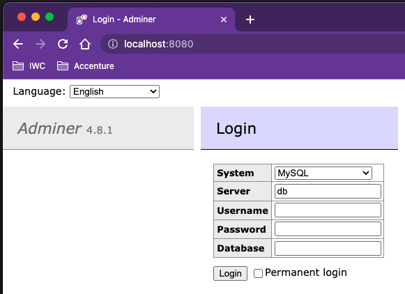
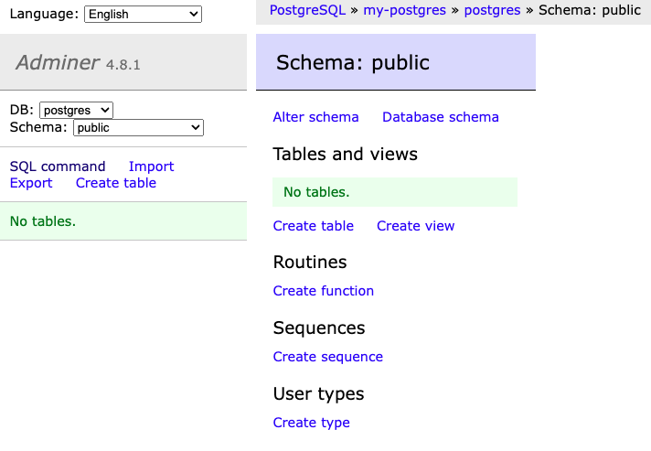
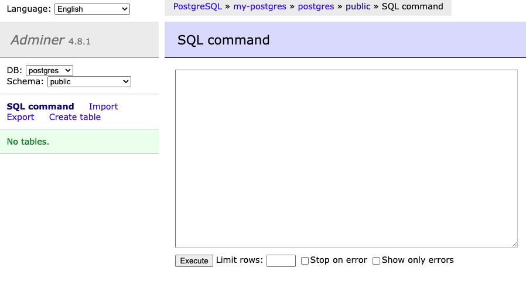

## Databases

---

### Overview

- What is a database?
- SQL
- DDL / DML
- Modelling
- Connecting to a database from Python

Notes:
SQL = Structured Query Language

DDL = Data Definition Language for schemas, part of SQL

DML = Data Manipulation Language for data, part of SQL

---

### Learning Objectives

- Learn the features of a database
- Learn why we need databases
- Get introduced to the differences between relational and non-relational databases
- See some examples of SQL and learn about DDL and DML
- Learn, and practice using, SQL commands to interact with a database
- Learn, and practice using, Python to interact with a database

Notes:
SQL = Structured Query Language

DDL = Data Definition Language for schemas, part of SQL

DML = Data Manipulation Language for data, part of SQL

---

### What is a Database?

<span>A collection of structured information or data organised for convenient access.</span><!-- .element: class="fragment" -->

---

Databases typically follow a client-server architecture:

<!-- .element: class="centered" -->

The client might be:

- A command line tool
- GUI tool
- A library for a programming language

Notes:
Meaning the client sends SQL queries to the database server.

The database server processes those queries, performs actions (like fetching or updating data), and returns the result to the client.

---

### Aspects of a Database

**Schema**: The information about the structure of the database and how things relate to each other.

**Table**: Holds a collection of columns and rows.

**Column**: A set of values of a particular data type (e.g. string or int).

**Row**: An individual entry in a table (sometimes called a record).

**Cell**: A single value at the intersection between a row and a column (sometimes called a field).

**Constraints**: Automatically restrict what data can appear in a column.

---

### Example table

#### Student

```text
| student_id | first_name | last_name | birth_date | mentor_id |
|------------|------------|-----------|------------|-----------|
| 001        | Bernard    | Matthews  | 19700101   | 123       |
| 002        | Josh       | Leeds     | 19410709   | 123       |
| 003        | Vince      | Levis     | 19930430   | 420       |
```

Notes:
An example

---

### Why do we need a database?

- Storing data in memory risks data loss
- Big files are slow to read and write
- Small files adds complexity to your application
- Integrity of data is easier to maintain
- Data security is easier to manage

Notes:
ask for suggestions from cohort

---

### So, how can we utilise it?

We can use an **RDBMS**. Otherwise known as a **Relational DataBase Management System**.

They allow us to work with tables and the relationships between them, typically through an application.

Notes:
How can we use relational databases.

**RDBMS** - An RDBMS (Relational Database Management System) is software that stores and manages data in tables, following the relational model. It uses SQL to query and manipulate data. Database Instances will be hosted on a server and RDBMS can connect to that instance then allow users to manage the system. Examples include: MySQL, PostgreSQL, and Oracle Database, which are widely used for managing structured data in applications.

---

### Some relational databases you may have heard of...

- Microsoft SQL Server
- MySQL
- Oracle
- PostgreSQL
- SQLite

We will be using PostgreSQL for this module.

Notes:
SQLite is built into the standard Python libraries.

---

### SQL

#### Structured Query Language

- **THE** language for querying relational databases
- Declarative, not imperative (i.e tell it what to do, not how to do it)

Notes:
Declarative: Building a program where we define the logic of a computation without describing its control flow.

Imperative: uses statements that change a program's state (like Python).

We will see some actual SQL further down.

---

### SQL Data Types

#### Like Python, SQL has data types:

**CHAR**: A _fixed_-length string with a 0-255 character size that is defined on table creation.

**VARCHAR**: A _variable_-length string with a 0-65535 size.

**BOOLEAN**: Zero is false, one is true.

**INTEGER**: An integer value.

**DECIMAL**: An exact fixed-point number.

---

### SQL Data Types

**DATE**: A date format.

**TIME**: A time format.

**TIMESTAMP**: A date-time format.

All of these types are for **PostgreSQL**. Different SQL providers can have different data types so be careful.

There are also [plenty more data types](https://www.postgresql.org/docs/current/datatype.html) out there, but we don't need to know them all right now.

---

### DDL vs DML

Data **Definition** Language:

- Create, alter and drop tables to create a schema

Data **Manipulation** Language:

- Working with the data in your tables

Notes:
SQL = Structured Query Language

DDL = Data Definition Language for schemas, part of SQL

DML = Data Manipulation Language for data, part of SQL

DDL commands are used to define and modify the structure of database objects like tables.

DML commands are used to manage the data inside the database tables.
Common DML commands:

- SELECT – Retrieves data from one or more tables.
- INSERT – Adds new data into a table.
- UPDATE – Modifies existing data.
- DELETE – Removes data from a table.

---

### DDL

**Data Definition Language**.

- Deals with database schemas and descriptions, and how the data should reside in the database

DDL handles these commands:

- **CREATE** - create database/table
- **ALTER** - alters the structure of existing database/table
- **DROP** - deletes tables from a database
- **TRUNCATE** - remove all records from a table
- **COMMENT** - add comments similar to Python
- **RENAME** - rename a table

---

### Create Database

```sql
CREATE DATABASE name_of_db;
```

---

### Create Table

Structure

```sql
CREATE TABLE < table name > (
column1 < type >,
column2 < type >,
.
.
.
);
```

---

### Example

```sql
CREATE TABLE person_details (
   person_id INTEGER GENERATED ALWAYS AS IDENTITY,
   first_name VARCHAR(100) NOT NULL,
   last_name VARCHAR(100) NOT NULL,
   age INTEGER,
   PRIMARY KEY(person_id)
);
```

Notes:
We will come back to primary key.

---

### Keywords

`NOT NULL`: Do not allow this field to be null when inserting a new record.

`GENERATED ALWAYS AS IDENTITY` is an auto-incrementing number

`PRIMARY KEY` tells us what is unique for each row

`VARCHAR` is a variable-length text field.

---

### Table Example

<!-- .element: class="centered" -->

---

### ALTER TABLE

We can manipulate the structure of existing tables;

```sql
ALTER TABLE person_details ADD date_of_birth DATE;
```

We can add and remove whole columns, and add and remove constraints.

<!-- .element: class="centered" -->

---

### DROP TABLE

You can remove a table entirely:

```sql
DROP TABLE person;
```

This is an operation which isn't used frequently, so be careful!

---

### Emoji Check:

Do you feel you understand the basics of databases? Say so if not!

1. 😢 Haven't a clue, please help!
2. 🙁 I'm starting to get it but need to go over some of it please
3. 😐 Ok. With a bit of help and practice, yes
4. 🙂 Yes, with team collaboration could try it
5. 😀 Yes, enough to start working on it collaboratively

Notes:
The phrasing is such that all answers invite collaborative effort, none require solo knowledge.

The 1-5 are looking at (a) understanding of content and (b) readiness to practice the thing being covered, so:

1. 😢 Haven't a clue what's being discussed, so I certainly can't start practising it (play MC Hammer song)
2. 🙁 I'm starting to get it but need more clarity before I'm ready to begin practising it with others
3. 😐 I understand enough to begin practising it with others in a really basic way
4. 🙂 I understand a majority of what's being discussed, and I feel ready to practice this with others and begin to deepen the practice
5. 😀 I understand all (or at the majority) of what's being discussed, and I feel ready to practice this in depth with others and explore more advanced areas of the content

---

### Exercise

> Instructor to distribute the database session zip file.

- Extract the zip file
- You should have the following folders:
    - `exercises`
    - `handouts`
    - `solutions` (no peeking!)

Notes:
Make sure everyone has done this

---

### Exercise

> We can use either `docker` or `podman`. If using `podman`, set up podman desktop and `podman-compose`

- Ensure podman desktop is installed for your platform, see [https://podman-desktop.io/docs/installation](https://podman-desktop.io/docs/installation)
- Once podman desktop is set up and a virtual machine is running, install `podman-compose` via the podman desktop UI, via `Settings > Resources > Compose Tile`

---

### Exercise

> Ensure docker or podman is running

---

### Exercise

- The rest of the slides use `docker` commands.
- If you are using `podman`, ask your instructor to help you set up an alias for podman so it points at docker: `alias docker="podman"`
- The following commands should all work in your terminal:
    - `docker --version`
    - `docker pull docker.io/postgres`
    - `docker pull docker.io/adminer`
    - `docker image ls`
        - in this list you should see "postgres" and "adminer"

Notes:
Make sure everyone has done this.

Everyone should already have the "postgres" and "adminer" images downloaded from the previous session.

---

### Exercise

> Ensure no old containers are docker running. We need to clean up from any previous Docker work.

- Run `docker ps -a`
- If you have anything running, stop it with `docker stop <container_name>`
- Remove all old containers with `docker rm <container_name>`
- Run `docker ps -a` again - you should have zero containers now!

Notes:
Make sure everyone has done this.

Make sure everyone has stopped and removed all old containers.

---

### Exercise

- Open a terminal in the  `handouts` directory.
- Run `docker compose up -d`
- You should get something similar to the following output:

```sh
 ✔ Container my-postgres   Started
 ✔ Container adminer       Started
```

Notes:
Make sure everyone has done this

---

### Exercise

- Browse to the <http://localhost:8080/> to open the `Adminer` page

You should see the Adminer homepage:

<!-- .element: class="centered" -->

Notes:

- Make sure everyone has done this

---

### Exercise

Log in with the following credentials:

- **System**: PostgreSQL
- **Server**: my-postgres
- **Username**: postgres
- **Password**: <see .env file>
- **Database**: postgres

---

### Exercise

You should see the Adminer table view:

<!-- .element: class="centered" -->

Notes:
Make sure everyone has done this

---

### Exercise

- Click on the "SQL Command" link

You should see the Adminer SQL Command page:

<!-- .element: class="centered" -->

Now we're ready to use some SQL!

Notes:
Make sure everyone has done this

---

### Exercise

> Complete `Part 1 - using DDL` in the exercise handout.
>
> Create a database, a table, and alter the table.

Notes:
Make sure everyone has done this

---

### Emoji Check:

How did you find exercises on creating and working with databases?

1. 😢 Haven't a clue, please help!
2. 🙁 I'm starting to get it but need to go over some of it please
3. 😐 Ok. With a bit of help and practice, yes
4. 🙂 Yes, with team collaboration could try it
5. 😀 Yes, enough to start working on it collaboratively

Notes:
The phrasing is such that all answers invite collaborative effort, none require solo knowledge.

The 1-5 are looking at (a) understanding of content and (b) readiness to practice the thing being covered, so:

1. 😢 Haven't a clue what's being discussed, so I certainly can't start practising it (play MC Hammer song)
2. 🙁 I'm starting to get it but need more clarity before I'm ready to begin practising it with others
3. 😐 I understand enough to begin practising it with others in a really basic way
4. 🙂 I understand a majority of what's being discussed, and I feel ready to practice this with others and begin to deepen the practice
5. 😀 I understand all (or at the majority) of what's being discussed, and I feel ready to practice this in depth with others and explore more advanced areas of the content

---

### DML

**Data Manipulation Language**.

- Deals with data manipulation, and includes most common SQL statements
- Used to store, modify, retrieve, delete and update data in database.

DML handles these commands (and more):

- **SELECT** - retrieve data from one or more tables
- **INSERT** - insert data into a table
- **UPDATE** - updates existing data within a table
- **DELETE** - delete all records from a table

---

### Who loves a single-quote?

> Postgres does!

DML Statements in PostgreSQL need single quotes `'`, not double-quotes `"`!

<div>
E.g.
<code>INSERT INTO person (first_name, last_name, age)
    VALUES ('Mike', 'Goddard', 28);</code>
</div><!-- .element: class="fragment" -->

Notes:
Note this to the Academites - it will be important later

---

### INSERT

As you would expect, this _inserts_ (adds) a row into your table

```sql
INSERT INTO person (first_name, last_name, age)
    VALUES ('Jane', 'Bloggs', 32);
INSERT INTO person (first_name, last_name, age)
    VALUES ('Joe', 'Bloggs', 28);
```

- Any non-null fields are required as a value
- Any field not provided with a value will default to null

---

### INSERT with RETURNING

We can get back the id that the server created with the `RETURNING` keyword:

```sql
INSERT INTO person (first_name, last_name, age)
    VALUES ('Joe', 'Bloggs', 28); RETURNING person_id;
```

This is especially useful when writing code (like python) that is adding the data for us.

Notes:
N/A

---

### Bulk INSERT clause (aka "multi-values")

You can insert multiple rows at once, which is very efficient. Here is an example;

```sql
INSERT INTO person (first_name, last_name, age)
    VALUES
        ('Jane', 'Bloggs', 32),
        ('Joe', 'Bloggs', 28);
```

You can also use `RETURNING` with this syntax.

---

### Exercise - 10 mins

> Complete `Part 2.1 - INSERT` in the exercise handout.
>
> Only do part 2.1!

Notes:
Tell everyone to only do "Part 2.1 - INSERT".

A breakout of 10 mins works well here.

---

### Discussion - INSERT

> Did we all get some data inserted?
>
> What problems did you have?

Notes:
Check if anyone had syntax problems, problems with single double quotes, and so on - any problems people had is good feedback for the other learners.

---

### Emoji Check:

How do you feel about inserting data?

1. 😢 Haven't a clue, please help!
2. 🙁 I'm starting to get it but need to go over some of it please
3. 😐 Ok. With a bit of help and practice, yes
4. 🙂 Yes, with team collaboration could try it
5. 😀 Yes, enough to start working on it collaboratively

Notes:
The phrasing is such that all answers invite collaborative effort, none require solo knowledge.

The 1-5 are looking at (a) understanding of content and (b) readiness to practice the thing being covered, so:

1. 😢 Haven't a clue what's being discussed, so I certainly can't start practising it (play MC Hammer song)
2. 🙁 I'm starting to get it but need more clarity before I'm ready to begin practising it with others
3. 😐 I understand enough to begin practising it with others in a really basic way
4. 🙂 I understand a majority of what's being discussed, and I feel ready to practice this with others and begin to deepen the practice
5. 😀 I understand all (or at the majority) of what's being discussed, and I feel ready to practice this in depth with others and explore more advanced areas of the content

---

### SELECTing Data

This is the skeleton command for selecting data:

```sql
SELECT ...

FROM ...

WHERE ...

ORDER BY ...

LIMIT ...
```

Only `SELECT` and `FROM` are required, the rest are optional but allow for more refined queries.

---

### SELECT

Specifies which fields to return and takes a comma-separated list of field names:

Takes a comma-separated list of field names:

```sql
SELECT first_name, last_name, age;
```

`*` represents all columns in the table:

```sql
SELECT *
```

---

### FROM

Specifying which table you're querying against:

```sql
SELECT first_name, last_name, age FROM person;
```

---

### WHERE

Specifying a predicate that evaluates whether a row should be returned. Can take in wildcard matching:

```sql
SELECT *
FROM person
WHERE age = 25;
```

Notes:
Predicate in layman's terms means applying a filter.

---

## Complex WHERE

You can build where clauses that use boolean operators.

You can compound the boolean operators for even more fun!

```sql
SELECT * FROM person
    WHERE first_name = 'Mike'
    AND (surname = 'Goddard' OR age >= 28);
```

Note that single quotes must be used for `WHERE` clause values in Postgres.

---

### ORDER BY

Specifying the order in which the data is returned.

Optionally, the direction of the order can be appended.

Can add multiple columns on which to order:

```sql
SELECT * FROM person
    WHERE age = 25
    ORDER BY first_name DESC;
```

Notes:
DESC or ASC determines if the results will be provided top-to-bottom or bottom-to-top.

---

### LIMIT

Limits the number of records returned:

```sql
SELECT * FROM person
    WHERE age = 25
    ORDER BY first_name DESC
    LIMIT 10;
```

---

### Exercise - 10 mins

> Complete `Part 2.2 - SELECT` in the exercise handout.
>
> Only do part 2.2!

Notes:
Tell everyone to only do "Part 2.2 - SELECT".

A breakout of 10 mins works well here.

---

### Discussion - SELECT

> Did we all get some data selected?
>
> What problems did you have?

Notes:
Check if anyone had syntax problems, problems with single double quotes, and so on - any problems people had is good feedback for the other learners.

---

### Emoji Check:

How do you feel about selecting data?

1. 😢 Haven't a clue, please help!
2. 🙁 I'm starting to get it but need to go over some of it please
3. 😐 Ok. With a bit of help and practice, yes
4. 🙂 Yes, with team collaboration could try it
5. 😀 Yes, enough to start working on it collaboratively

Notes:
The phrasing is such that all answers invite collaborative effort, none require solo knowledge.

The 1-5 are looking at (a) understanding of content and (b) readiness to practice the thing being covered, so:

1. 😢 Haven't a clue what's being discussed, so I certainly can't start practising it (play MC Hammer song)
2. 🙁 I'm starting to get it but need more clarity before I'm ready to begin practising it with others
3. 😐 I understand enough to begin practising it with others in a really basic way
4. 🙂 I understand a majority of what's being discussed, and I feel ready to practice this with others and begin to deepen the practice
5. 😀 I understand all (or at the majority) of what's being discussed, and I feel ready to practice this in depth with others and explore more advanced areas of the content

---

### Modifying Data

Notes:
N/A

---

### UPDATE

A way to change a row that is already stored:

```SQL
UPDATE person SET age = 25 WHERE first_name = 'Joe';
```

Best practice is to update by the primary key id(s):

```sql
UPDATE person SET age = 25 WHERE person_id = 123;
```

---

> What happens if we miss off the `WHERE`?

```sql
UPDATE person SET age = 25;
```

<span>Answer: We change everyone at once!</span><!-- .element: class="fragment" -->

Notes:
N/A

---

### Exercise - 10 mins

> Complete `Part 2.3 - UPDATE` in the exercise handout.
>
> Only do part 2.3!

Notes:
Tell everyone to only do "Part 2.3 - UPDATE".

A breakout of 10 mins works well here.

---

### Discussion - UPDATE

> Did we all get some data updated?
>
> What problems did you have?

Notes:
Check if anyone accidentally updated all the rows, had syntax problems, problems with single double quotes, and so on - any problems people had is good feedback for the other learners.

---

### DELETE

Deletes a row given certain conditions:

```sql
DELETE FROM person WHERE first_name = 'Joe';
```

Best practice is to delete by the primary key id(s):

```sql
DELETE FROM person WHERE person_id = 456;
```

---

### Question: DELETE

> What happens if we miss off the `WHERE`?

```sql
DELETE FROM person;
```

<span>Answer: We delete everyone at once! Possibly a P45 too!</span><!-- .element: class="fragment" -->

Notes:
N/A

---

### Exercise - 10mins

> Complete `Part 2.4 - DELETE` in the exercise handout.
>
> Only do part 2.4!

Notes:
Tell everyone to only do "Part 2.4 - DELETE".

A breakout of 10 mins works well here.

---

### Discussion - DELETE

> Did we all get some data inserted?
>
> What problems did you have?

Notes:
Check if anyone accidentally deleted all rows, had syntax problems, problems with single double quotes, and so on - any problems people had is good feedback for the other learners.

---

### Emoji Check:

How did you feel about updating and deleting data?

1. 😢 Haven't a clue, please help!
2. 🙁 I'm starting to get it but need to go over some of it please
3. 😐 Ok. With a bit of help and practice, yes
4. 🙂 Yes, with team collaboration could try it
5. 😀 Yes, enough to start working on it collaboratively

Notes:
The phrasing is such that all answers invite collaborative effort, none require solo knowledge.

The 1-5 are looking at (a) understanding of content and (b) readiness to practice the thing being covered, so:

1. 😢 Haven't a clue what's being discussed, so I certainly can't start practising it (play MC Hammer song)
2. 🙁 I'm starting to get it but need more clarity before I'm ready to begin practising it with others
3. 😐 I understand enough to begin practising it with others in a really basic way
4. 🙂 I understand a majority of what's being discussed, and I feel ready to practice this with others and begin to deepen the practice
5. 😀 I understand all (or at the majority) of what's being discussed, and I feel ready to practice this in depth with others and explore more advanced areas of the content

---

### Primary Key

- A special table column (or combination of columns) that uniquely identify each record
- Every row must have a PK and must be unique
- Often a self-incrementing number
- Cannot be `null`

```sql
CREATE TABLE person (
  person_id INTEGER GENERATED ALWAYS AS IDENTITY,
  PRIMARY KEY(person_id)
);
```

Notes:
Demo this in Adminer

Add some rows, show how the restrictions apply

---

### Foreign Key

- A column (or combination of columns) that provides a link between two tables
- Acts as a cross-reference between two tables as it references the PK of another table
- Must always reference a PK

```sql
CREATE TABLE contact_info(
  id INTEGER GENERATED ALWAYS AS IDENTITY,
  person_id INTEGER,
  phone VARCHAR(15),
  email VARCHAR(100),
  PRIMARY KEY(id),
  FOREIGN KEY(person_id) REFERENCES person(person_id)
);
```

Notes:
Demo this in Adminer

Add some rows, show how the restrictions apply

---

### Emoji Check:

Do you feel you understand the basics of DML (Insert, update, delete and select)? Say so if not!

1. 😢 Haven't a clue, please help!
2. 🙁 I'm starting to get it but need to go over some of it please
3. 😐 Ok. With a bit of help and practice, yes
4. 🙂 Yes, with team collaboration could try it
5. 😀 Yes, enough to start working on it collaboratively

Notes:
The phrasing is such that all answers invite collaborative effort, none require solo knowledge.

The 1-5 are looking at (a) understanding of content and (b) readiness to practice the thing being covered, so:

1. 😢 Haven't a clue what's being discussed, so I certainly can't start practising it (play MC Hammer song)
2. 🙁 I'm starting to get it but need more clarity before I'm ready to begin practising it with others
3. 😐 I understand enough to begin practising it with others in a really basic way
4. 🙂 I understand a majority of what's being discussed, and I feel ready to practice this with others and begin to deepen the practice
5. 😀 I understand all (or at the majority) of what's being discussed, and I feel ready to practice this in depth with others and explore more advanced areas of the content

---

### Quiz Time! 🤓

---

**Which of these describes an entry in a table?**

1. Field
1. Column
1. Record
1. Table

Answer: `3`<!-- .element: class="fragment" -->

---

**Which of these best describes DDL?**

1. Deals with database schemas and descriptions, and how the data should reside in the database.
1. Deals with storage of data, modifications, retrievals, deletes and updates in a database.
1. Specifies which fields to return in a query and takes a comma-separated list of field names.
1. A special table column (or combination of columns) that uniquely identify each record.

Answer: `1`<!-- .element: class="fragment" -->
