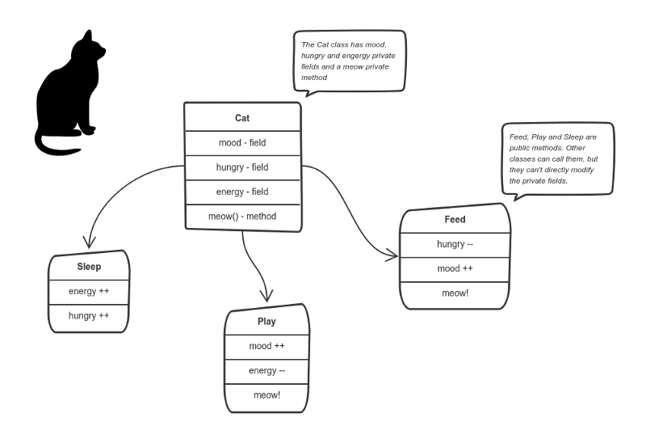
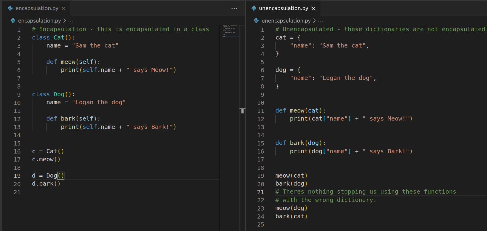
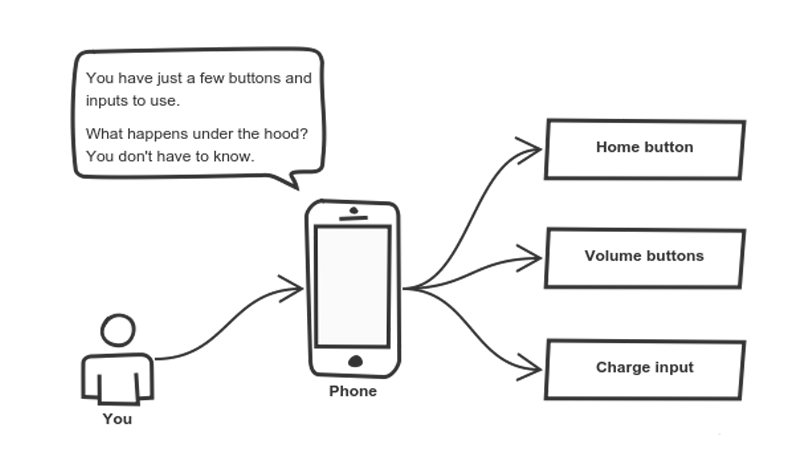
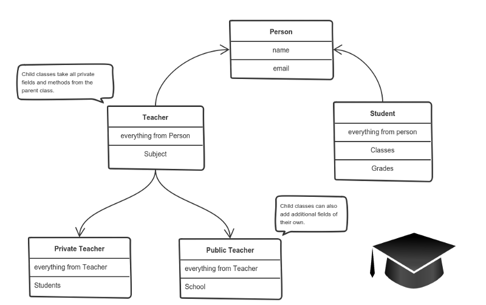
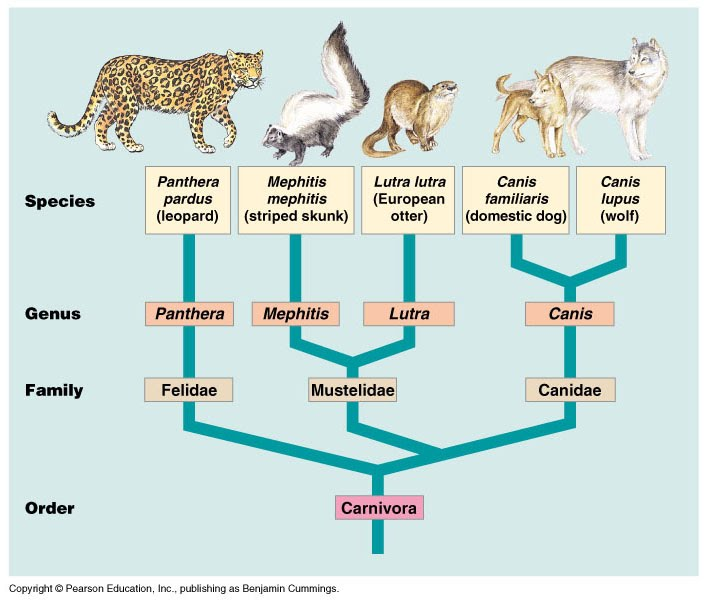
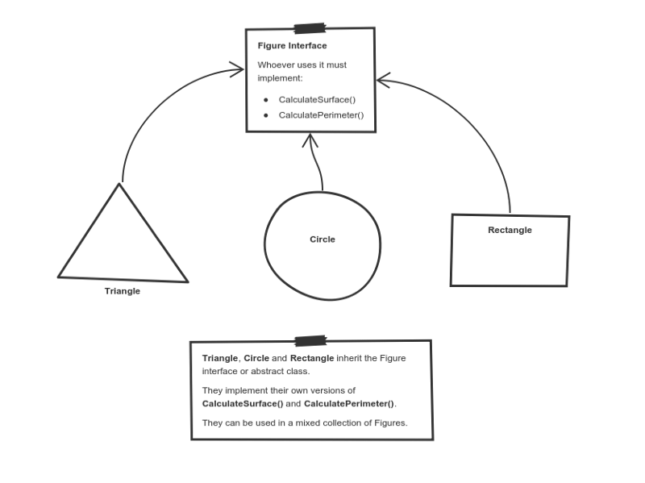

## Object Oriented Programming

---

### Overview

- Introduction to Object Oriented Programming (OOP)
- Built-in Types
- Defining our own Types
- The Four Principles of OOP

---

### Learning Objectives

- Define Object Oriented Programming
- Understand Types, Classes and Objects
- Discover how we can use Type-Hinting to make our code cleaner
- Identify the four principles of OOP
- Implement OOP using Python

---

### Opening Exercise

Take a look at `vehicles_v1.py` in the `handouts` folder. Run the file. Can you understand what the code is doing?

Now look at `vehicles_v2.py`. We have added a bike into our vehicle fleet. What happens when we run the code?

In groups of 2-3, make changes to `vehicles_v2.py` so that the `print_report()` function works as expected. Remember to read the comments in the code.

Notes:
First open `vehicles_v1.py` and talk through the code. Show the code running and highlight the print statements that are shown in the terminal.

Then ask the question, 'what happens if we want to add a different type of vehicle into our vehicle fleet, such as a bike?'. Open `vehicles_v2.py` and explain that bicycles don't have engines so the 'engine' key does not exist on the vehicle.

Give the learners 10-15mins to work on a solution in groups. When the learners return, get them to share their different solutions. Discuss the merits of each. Explain that object oriented programming is aiming to solve these sorts of problems.

---

### What is OOP?

A programming paradigm based on the concept of "objects", which can contain data and code.

**Data** is in the form of fields, often known as attributes or properties.

**Code** is in the form of procedures, often known as methods.

Most popular programming languages are class-based, meaning that "objects" are instances of _classes_, which also determines their _type_.

---

### Definitions

- **Type**: What something is a type of, such as a string, integer, boolean, etc.
- **Class**: A blueprint which defines the properties and methods of a _type_. Describes what makes a string type different from an integer type, for example.
- **Object**: An instance of a _type_ which is modelled on a _class_. A specific string or integer value, for example.

---

### Built-in Types

The _class_ definitions that describe the primitive types (String, Number, Boolean etc...) are built into Python and this complexity is **abstracted** away from us. This helps us to write programs quicker and is part of what makes Python a high-level language.

Notes:
A primitive type is used to build more complex types.

---

### Example

When we create a new string, we actually instantiate an object of _type_ `str`. Each string is made from the same _class_ so it has the same methods and properties available to it.

```py
msg = "hello, I'm a string value!"
# `msg` is an object of type `str`
# `msg` has access to the `str` methods
# defined by the `str` class

msg.count() # 24
msg.capitalize() # Hello I'm a string value
msg.upper() # HELLO I'M A STRING VALUE
#...
```

---

### What do we think so far?

- Built-in types make our life a lot easier
- Without the string methods, we'd have to create that functionality ourselves
- With everything being an object, handy bits of functionality are attached to the thing they represent

Notes:
Start a discussion around these points and ask them for thoughts. The idea here is to check understanding, and reveal some of the OOP principles coming next.

---

### Defining Our Own Types

Imagine trying to keep track of a number of people and their attributes. We could represent each person as an object of _type_ `list`:

```python
#        Name       Age?  Height? Weight?
jane = ['Jane Doe', 20,  175,   150]
john = ['John Doe', 30,  180,   160]
joe =  ['Joe Doe',  40,  190,   170]
```

What if we're managing 100s or 1000s of people like this? What are some problems that might occur?

Notes:
Discuss with the learners why maintaining people like this is problematic.

1. What if we want to add/remove attributes?
2. How do we know which value represents which attribute?
3. How do we enforce required / optional attributes?
4. What about default values?
5. Is there any specific logic we would want to perform on a person?

Say that a great way to manage code like this is to create a custom `Person` _type_.

---

### Defining a Person Type

A _type_ definition begins with the `class` keyword.

```python
class Person:
    #...
```

The `class` is a template for the object. We can `initialise` an `instance` of a class from this template like so:

```py
jane = Person()
```

**Note**: Custom _types_ follow the `PascalCase` naming convention.

Notes:
PascalCase - popularised by the Pascal programming language

camelCase

kebab-case

snake_case - name origin unclear, but kinda looks like snake, stays low down to the ground

---

### The Constructor

The properties that form our initial `Person` are defined in a method called `__init__`.

This is commonly referred to as the **constructor** as it constructs the initial state of our object.

```python
class Person:
    # Constructor
    def __init__(self, name, age):
        # Properties
        self.name = name
        self.age = age
        print("Created new person")
```

Notes:
That is, `__init__()` initialises each new instance of the class.

You can give it any number of parameters but the first is always self.

We can also define default properties(props) here too.

---

### Calling The Constructor

The constructor is called when an `instance` of that class is `initialised` like `jane = Person("Jane", 26)`.

```python
class Person:
    # Constructor
    def __init__(self, name, age):
        # Properties
        self.name = name
        self.age = age
        print("Created new person")

jane = Person("Jane", 26) # Initialising a new person
```

This program prints the words `Created new person` because the `__init__` function is called when `initialising` a new person.

---

### Self

`self` is a **reference** to the current instance of the class.

It is used to access variables and methods that belong to itself.

It is always the first argument when defining methods.

```python
class Person:
    # Constructor
    def __init__(self, name, age):
        self.name = name
        self.age = age
```

Notes:
It doesn't have to be named self, but it's typical practice.

Self is not a keyword either.

---

### Adding Methods

```python
class Person:
    # Constructor
    def __init__(self, name, age):
        # Properties
        self.name = name
        self.age = age

    # Method
    def increment_age(self):
        self.age += 1
```

---

### Creating a Person

The built-in `int` type can be constructed from a string representation `int("1234")`.

Our custom `Person` type can similarly be constructed by passing the required values into the _constructor_ of the Person class.

```python
john = Person('John', 10) # is an object of type `Person`

# Just like `str` we can access its
# properties(props) and methods using dot notation

john.age # 10
john.increment_age()
john.age # 11
```

---

### A note on object types

```py
john                # is an object of type `Person`

john.age            # is an object of type `int`

john.name           # is an object of type `str`

john.name.upper()   # we still have access to all
                    # the string methods
```

---

### Quiz Time! 🤓

---

**What will this code output?**

```py
class Person:
    def __init__(self, name, age):
        self.name = name
        self.age = age

    def increment_age(self):
        self.age += 1

    def introduce_yourself(self):
        print(f"Hello my name is {self.name}, " \
        f"I am {self.age} years old.")
p = Person("Alice", 25)
p.increment_age()
p.introduce_yourself()
```

1. `Hello my name is Alice, I am 25 years old.`
1. `Hello my name is Alice, I am 26 years old.`
1. `Hello my name is 25, I am Alice years old.`
1. `NameError: name 'self' is not defined.`

Notes:
Answer is `2. Hello my name is Alice, I am 26 years old.` because the age is incremented before introduce_yourself is called.

Answer: `2`<!-- .element: class="fragment" -->

---

### Exercise

Instructor to distribute exercise.

> Start working with: `exercises/object-oriented-programming-exercises.md`.
>
> Let's all do `Part 1`, taking a look at classes and methods.

---

### Type Hinting

- When defining a function, you can define what `type` the arguments are.
- The type for each argument is defined after the colon `a: int`.
- The return type of the function is shown by the arrow `-> int`.

For example `add_numbers` takes two integers and `add_strings` takes two strings.

```py
# Arguments a and b are of type int
# This function return an int
def add_numbers(a: int, b: int) -> int:
    return a + b

# Arguments a and b are of type string
# This function returns a str
def add_strings(a: str, b: str) -> str:
    return a + b

add_numbers(1, 2)
add_strings("hello", " world")
```

Notes:
Type hinting does not actually enforce at runtime the data that is passed; type hinting is only to help the developer.

Some development tools may also warn you about it if configured to do so. Can get type hinting validation in VSCode with Pylance extension:
https://www.emmanuelgautier.com/blog/enable-vscode-python-type-checking/

---

### Benefits of Type Hinting

By defining the types in the arguments, VSCode will suggest the relevant functions for that type. For example a `str` will suggest the `title` and `capitalize` functions.

```py
def add_strings(a: str, b: str):
    return a.title() + b.capitalize()
```

This allows us as developers to better express the intent of our code, and to work with code ourselves and other developers have written without ambiguity.

---

### Quiz Time! 🤓

---

**Which of the following is the correct usage of type hinting?**

```py
def add_numbers(a, b) -> int: #1

def add_numbers(a int, b int) --> int: #2

def add_numbers(a: int, b: int) --> int: #3

def add_numbers(a: int, b: int) -> int: #4
```

Answer: `4`<!-- .element: class="fragment" -->

---

### Type Hinting for Complex Types

We can use any Python types in the [typing module](https://docs.python.org/3/library/typing.html#module-typing). For example, in `print_cars` we are using `List[Dict[str, str]]` to show the argument is a list of dictionaries.

```py
# Import the List and Dictionary types
from typing import List, Dict

# The cars argument is a list of dictionaries
def print_cars(cars: List[Dict[str, str]]):
    for car in cars:
        print(f"Brand: {car['brand']}, Colour: {car['colour']}")

# This cars variable is type List[Dict[str, str]]
cars = [{"brand": "BMW", "colour": "Blue"},
        {"brand": "Volvo", "colour": "Red"}]

print_cars(cars)
```

---

### Type Hinting with our own Classes

Once you've defined your own types, you can use them just like built in types.

```py
class Person():
    name = "Jane"
    age = 26

# This function takes an argument person
# which is of type Person
def greet_person(person: Person):
    print(f"Hello {person.name}")

jane = Person()

greet_person(jane)
```

---

### Complex Type Hinting with Classes

We can combine our types with anything in the [typing module](https://docs.python.org/3/library/typing.html#module-typing). For example, in `greet_people` we are using the `List` type from `typing` with our `Person` class to show the argument is a list of people.

```py
from typing import List  # Import the List type

# greet_people takes a list of people as an argument
def greet_people(people: List[Person]):
    for person in people:
        greet_person(person)

```

---

### Quiz Time! 🤓

---

**What will this output?**

```py
class Person():
    def __init__(self, name):
        self.name = name

    def greet(self):
        print(f"Hello {self.name}")

people = [Person("Jane"), Person("Sam")]

for person in people:
    person.greet()
```

1. `Hello Sam\nHello Jane`
1. `keyError: can not read name of List`
1. `Hello Jane\nHello Sam`
1. `Hello Jane\nHello Jane`

Notes:
In these solutions `\n` is a newline.
Answer is `3. Hello Jane\nHello Sam`

Answer: `3`<!-- .element: class="fragment" -->

---

### The Four Principles of OOP

- Encapsulation
- Abstraction
- Inheritance
- Polymorphism

---

### Encapsulation

<!-- .element: class="centered" -->

---

### Encapsulation

- Grouping together of properties(props) and methods which define a _type_
    - i.e. Bundling up of data and functions that operate on that data into a consistent unit
- Controlling how properties are accessed and used
    - The props of the cat are stored inside the object itself
    - Specific methods can be used by external callers to modify or access specific values

---

### Encapsulation

Encapsulation provides context to variables and functions. A dog barks while a cat meows. This can prevent you calling the wrong function with the wrong type.

<!-- .element: class="centered" -->

---

### The Four Principles of OOP

- Encapsulation ✅
- Abstraction
- Inheritance
- Polymorphism

---

### Abstraction

<!-- .element: class="centered" -->

---

### Abstraction

- We do not need to know how things work in order to use them
- We just need to know that they exist, and how they should be used
- Implementation specifics can be hidden from us and different, as long as the thing provides a consistent interface

---

### Abstraction Example

Please refer to the `abstraction.py` handout.

Notes:
Read the comments:
Phone is an abstract class because it contains an abstract method.
Smart phone inherits from phone because its a kind of phone.
The other kinds of phone also inherit from Phone. As a result all of the phones are capable of calling a friend.
So the `arrange birthday party` function uses a phone, but it doesn't matter what kind of phone you use. All that matters is you can use it to call a friend.

---

### The Four Principles of OOP

- Encapsulation ✅️
- Abstraction ✅
- Inheritance
- Polymorphism

---

### Inheritance

<!-- .element: class="centered" -->

---

### Inheritance

- The process by which one class takes on the attributes/methods of another
- A class inheriting from another is called a **child** class
- The class that is being inherited from is called a **parent** class
- Child classes can **override** or **extend** parent class methods to allow for different behaviours
- Child classes can add new **methods** or **properties**

Notes:
This is classical inheritance as opposed to the proto-typical inheritance we see in the likes of JS

---

### Example: Define our base type

```py
class Person:
    def __init__(self, name):
        self.name = name

    def introduce(self):
        return f"I am {self.name}"
```

---

### Example: Derive a sub-type

```py
class Employee(Person):
    def __init__(self, name, job_title):
        self.name = name
        self.job_title = job_title

    def describe_profession(self):
        return f"I work as a {self.job_title}"
```

```py
e = Employee("Rebecca", "Developer")
# Can still introduce
print(e.introduce())
# But also can now describe profession
print(e.describe_profession())

```

---

### How to use super() function

The `super()` function allows to access parent class from inside child class functions.

```py
class Person:
    def __init__(self, name, age):
        self.name = name
        self.age = age

class Student(Person):
    def __init__(self, name, age, course_name):
        self.course_name = course_name
        super().__init__(name, age)
```

---

### The Natural World

<!-- .element: class="centered" -->

Notes:
Reveal the different objects, classes / types, and the inheritance tree in this picture of taxonomies

Species -> Genus -> Family -> Order

A leopard is a type of Species, which is a type of Genus...

So when we create a Leopard, we get the entire animal kingdom attached to it and then some

What would happen if we changed some of the behaviour of the `Order` type?

It would affect everything downstream, and they would not be aware of it

This is the problem with inheritance and why if we do use it, we stick to only one level: Child -> Parent

---

### Inheritance Example

Please refer to the `inheritance.py` handout.

In this example:

- The `Wolf` can eat because it _inherited_ the `eat` function from `Animal`.
- The `eat` function eats whatever `favourite_food` is on the class.
- The `Wolf` eats `The 3 Little Piggies` whereas other Animals do not.

---

### The Four Principles of OOP

- Encapsulation ✅
- Abstraction ✅
- Inheritance ✅
- Polymorphism

---

### Polymorphism

<!-- .element: class="centered" -->

---

### Polymorphism

- Means "many forms" in Greek
- Different forms implement different behaviours for the same functionality
- Each shape class must be able to calculate it's perimeter, but the formula is different for each.

---

### Example

Open the Python Interpreter and write this simple class:

```py
>>> class MyClass:
...   pass
```

Then run this:

```py
>>> c = MyClass()
>>> dir(c)
```

What do you see?

---

### Example

`dir()` returns a list of all the members of a specified object. You didn't declare any members in `MyClass` so where did it come from?

If you run the following, you will get the same list near enough.

```sh
o = object()
dir(o)
```

---

### Every class you create in Python is always a form of `object`.

Notes:
This may not be the best way to reveal this, but we can think of `object` as being an abstract class, much like the figure class in the diagram.

All our types are objects, just they are different implementations of the required object methods, most of which is abstracted away from us.

Revealing that everything is a form or type of object is hopefully a good way to conclude

---

### The Four Principles of OOP Example

Please refer to the `handouts/inhabitants-example` folder.

The main file to be run is `household.py`.

In this example:

- The `Cat` class inherits from both `Inhabitant` and `Animal` overriding some methods.
- The `Person` class inherits from `Inhabitant` overriding some methods.
- The `household.py` brings everything together to track inhabitants in the household.
- There are also an examples of overriding python `object` class method `__str__`.

---

### Quiz Time! 🤓

---

**What is the output for the following piece of code?**

```py
class A:
    def __init__(self, x=3):
        self.x = x

class B(A):
    def __init__(self):
        super().__init__(5)

    def print(self):
        print(self.x)

obj = B()
obj.print()
```

1. `3`
2. `5`
3. `An error is thrown`

Answer: `5`<!-- .element: class="fragment" -->

---

**Which of these best describes inheritance?**

1. `Controls the privacy of properties and methods of a class.`
1. `We do not need to know how things work in order to use them.`
1. `The process by which one class takes on the attributes/methods of another.`
1. `Different forms can implement their own versions of required methods.`

Answer: `3`<!-- .element: class="fragment" -->

---

### Exercise

> Continue working with: `exercises/object-oriented-programming-exercises.md`.
>
> Let's all do `Part 2`, taking a look at inheritance with classes.

---

### Terms and Definitions - recap

**Object**: Where concepts are represented as objects.

**Object Oriented Programming**: A programming paradigm based on the concept of "objects", which can contain data and code.

**Class**: An extensible program-code-template for creating objects, providing initial values for state and implementations of behaviour.

**Property**: A special sort of class member, intermediate in functionality between a field (or data member) and a method.

---

### Terms and Definitions - recap

**Instance**: A concrete occurrence of any object, existing usually during the runtime of a computer program.

**Attribute**: The specific value of a given instance.

**Abstraction**: The process of removing details or attributes to focus attention on details of greater importance.

**Inheritance**: The mechanism of basing an object or class upon another object.

---

### Overview - recap

- Introduction to Object Oriented Programming (OOP)
- Built-in Types
- Defining our own Types
- The Four Principles of OOP

---

### Learning Objectives - recap

- Define Object Oriented Programming
- Understand Types, Classes and Objects
- Discover how we can use Type-Hinting to make our code cleaner
- Identify the four principles of OOP
- Implement OOP using Python

---

### Further Reading

- FreeCodeCamp: [How to explain OOP...](https://www.freecodecamp.org/news/object-oriented-programming-concepts-21bb035f7260/)
- YouTube: [Composition / Inheritance](https://youtu.be/wfMtDGfHWpA)

---

### Emoji Check:

On a high level, do you think you understand the main concepts of this session? Say so if not!

1. 😢 Haven't a clue, please help!
2. 🙁 I'm starting to get it but need to go over some of it please
3. 😐 Ok. With a bit of help and practice, yes
4. 🙂 Yes, with team collaboration could try it
5. 😀 Yes, enough to start working on it collaboratively

Notes:
The phrasing is such that all answers invite collaborative effort, none require solo knowledge.

The 1-5 are looking at (a) understanding of content and (b) readiness to practice the thing being covered, so:

1. 😢 Haven't a clue what's being discussed, so I certainly can't start practising it (play MC Hammer song)
2. 🙁 I'm starting to get it but need more clarity before I'm ready to begin practising it with others
3. 😐 I understand enough to begin practising it with others in a really basic way
4. 🙂 I understand a majority of what's being discussed, and I feel ready to practice this with others and begin to deepen the practice
5. 😀 I understand all (or at the majority) of what's being discussed, and I feel ready to practice this in depth with others and explore more advanced areas of the content
